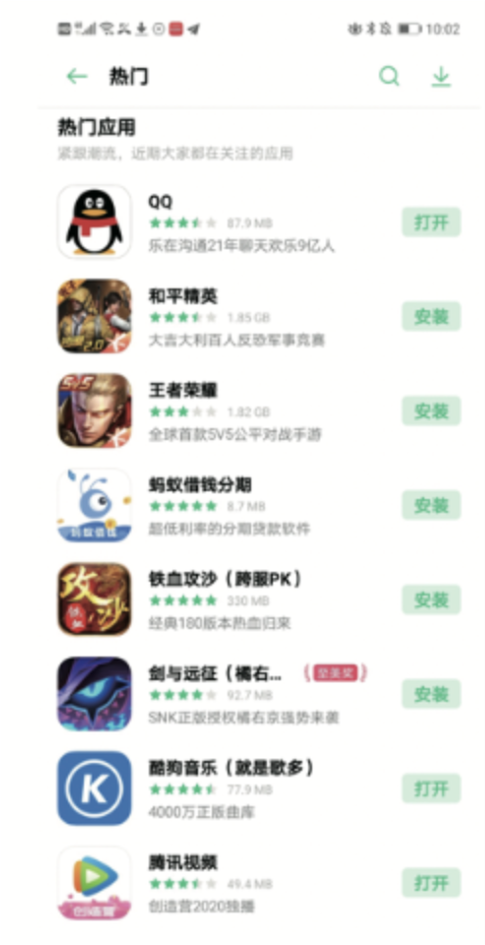
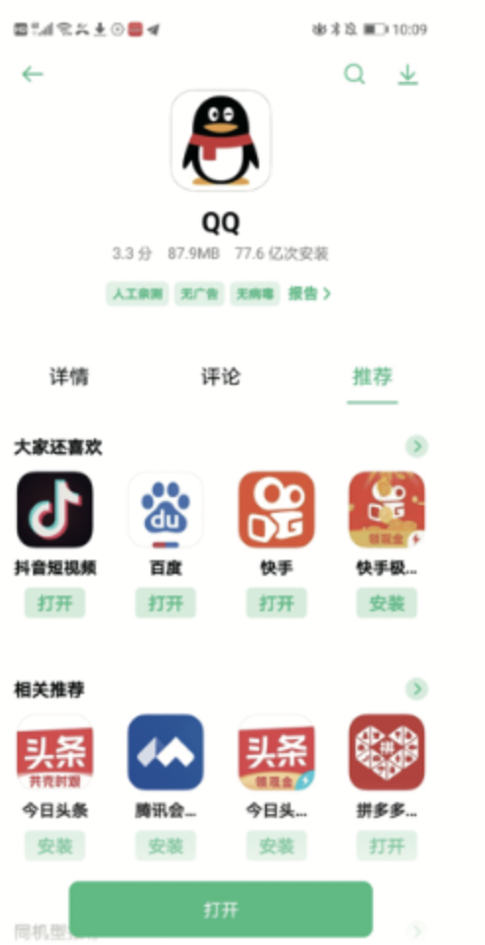
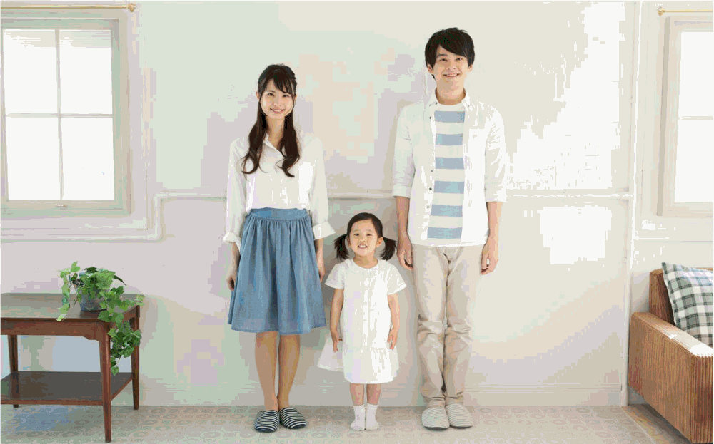
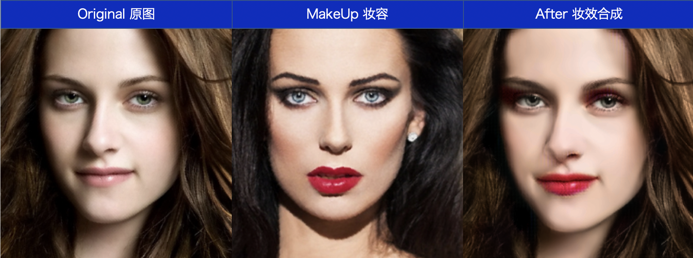
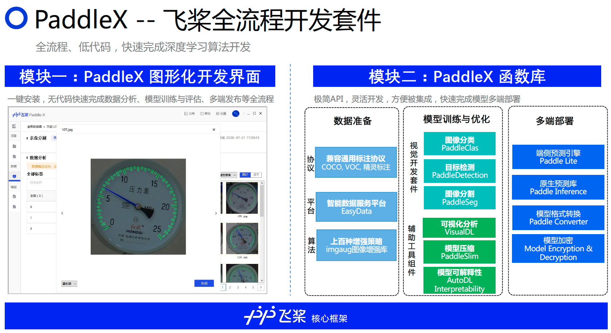
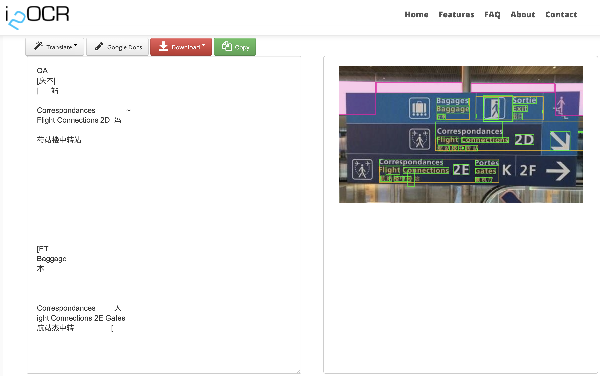
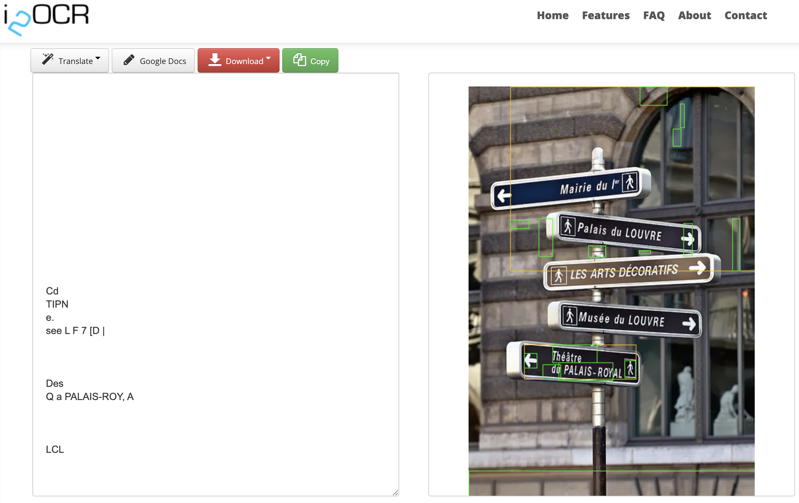

<style scoped>
section h1 {text-align: center;font-size: 80px;color:black;}
</style>

# A Quick Guide on How to Launch AI with Paddle tools

#### JIANG Li

#### Orange Labs China

## Contents

### PaddlePaddle Introduction

- PaddlePaddle Ecosystem

- PaddlePaddle Industrial Cases

- PaddlePaddle Tools and Pretrained Models

### Hands on Demo

- PaddleHub

- PaddleOCR pretrained models

- PaddleOCR training new models

## PaddlePaddle Ecosystem

Baidu's [PaddlePaddle](https://github.com/paddlepaddle/paddle) is the first open-source deep-learning platform in China. Since 2016, it has been used by more than 2.3 million developers.

<div align="center"></div>

<!-- Leading framework: An easy-to-use, efficient/effective and secure deep learning framework aims to meets all the developers' demands for modeling, training and deployment of deep neural networks. -->

<!-- Basic models bank: The SOTA pretrained models and developer tools for different scenarios, including PaddleNLP, PaddleCV, PaddleRec and PaddleSpeech. -->

<!-- End-to-end development kits: Full-stack development kits, including ERNIE, PaddleSeg, PaddleDetection and etc., facilitate the design and implementation of industrial applications. -->

<!-- Feature-rich tools & components: Deep learning tools and components, together with AutoDL, PaddleHub, PARL, PaddleFL and etc., offer more features than you may expect. -->

<!-- Professional service platforms: AI Studio, EasyDL and BML -- three professional service platforms carry out all requests from developers. -->

## PaddlePaddle Industrial Cases

### AI Pest identification - Dendroctonus valens leconte monitoring system

PaddlePaddle helps the implementation of forestry pest monitoring. The detection model YOLOv3 is trained using PaddlePaddle. It can automatically identify the Dendroctonus-valens-LeConte, making the remote detection of pest attacks possible. Open source demo code can be find in [PaddleX Detection example](https://github.com/PaddlePaddle/PaddleX/blob/develop/tutorials/train/object_detection/).

<div align="center"> </div>

<!-- Dendroctonus-valens-LeConte is a kind of stem-boring pest that endangers more than 35 species of Pinaceae plants.-->


## PaddlePaddle Industrial Cases

### OPPO Recommendation Solution

OPPO is a world's leading smart device manufacturers and innovators. Starting from 2018, it set up internet business such as information flow, app store, game center, etc.. Along with the business expansion, a large-scale recommendation system is needed.

#### Application Scheme

Upgrade OPPO App Store with Paddle:

1. Dataset API for large scale data process
2. Parameter Server for large scale asynchronous training

#### Application Effect




1. High Performance: all asynchronous training cluster
2. Large scale model: model size enlarged by several times
3. Low resource: memory consumption is significantly reduced

## PaddlePaddle Tools and Pretrained Models

PaddlePaddle includes and maintains more than 100 mainstream models and more than 200 pretrained models to facilitate the rapid development of industrial applications.

### [PaddleHub](https://github.com/PaddlePaddle/PaddleHub)

<div align="center"></div>

<div align="center"></div>

<!-- SkyAR pretrained model transfered from https://github.com/jiupinjia/SkyAR -->

## PaddlePaddle Tools and Pretrained Models

### [PaddleGAN](https://github.com/PaddlePaddle/PaddleGAN)

<div align="center"></div>

<div align="center"></div>

<!-- Motion driving -->

## PaddlePaddle Tools and Pretrained Models

### [PaddleDetection](https://github.com/PaddlePaddle/PaddleDetection)

<div align="center"></div>


## PaddlePaddle Tools and Pretrained Models

### [PaddleX](https://github.com/PaddlePaddle/PaddleX)

PaddleX integrated the abilities of **Image classification**, **Object detection**, **Semantic segmentation**, and **Instance segmentation** in the Paddle CV toolkits, and get through the whole-process development from **Data preparation** and **Model training and optimization** to **Multi-end deployment**. At the same time, PaddleX provides **Succinct APIs** and a **Graphical User Interface**. Developers can quickly complete the end-to-end process development of the Paddle in a form of **low-code**  without installing different libraries.

<div align="center"></div>

<!--  -->

## Demo Time

Now let's try some demos!

### Paddle Installation

[Installation Guide](https://www.paddlepaddle.org.cn/install/quick?docurl=/documentation/docs/en/install/pip/linux-pip_en.html)

```
python -m pip install paddlepaddle -i https://mirror.baidu.com/pypi/simple
```

#### Verify installation

```
>>> import paddle
>>> paddle.utils.run_check()
Running verify PaddlePaddle program ... 
.
PaddlePaddle is installed successfully! Let's start deep learning with PaddlePaddle now.
```

#### Download Demo Code

```
git clone --recurse-submodules https://github.com/thinkall/paddle2-demo
```

## PaddleHub
### Mask Detection

```
python hub_mask.py
```

- Mask Detection with PaddleHub

<div align="center"> </div>

---

### Line Draft

```
python hub_line.py
```

- Line Draft Extraction with PaddleHub

<div align="center"> </div>


## PaddleOCR Pretrained Model

```
python ocr-visual.py
python gradio-demo.py  # for online service
```

- PaddleHub OCR VS [i2OCR Free French OCR](https://www.i2ocr.com/free-online-french-ocr)

<div align="center"></div>

<div align="center"></div>


## PaddleOCR Pretrained Model

- PaddleHub OCR VS [i2OCR Free French OCR](https://www.i2ocr.com/free-online-french-ocr)





## PaddleOCR Model Training

<!-- ### Download PaddleOCR

```
git clone https://github.com/PaddlePaddle/PaddleOCR.git
``` -->

### Prepare dataset
```
ln -sf $PWD/data/ocr ./PaddleOCR/train_data
```

### download pretrained model
```
cd PaddleOCR/

if [ ! -d "./pretrain_models/rec_mv3_none_bilstm_ctc_v2.0_train" ];then
  # Download MobileNetV3 pretrained model
  wget -P ./pretrain_models/ https://paddleocr.bj.bcebos.com/dygraph_v2.0/ch/ch_ppocr_mobile_v2.0_rec_pre.tar
  # unzip model parameters files
  cd pretrain_models
  tar -xf ch_ppocr_mobile_v2.0_rec_pre.tar && rm -rf ch_ppocr_mobile_v2.0_rec_pre.tar
fi
```

## PaddleOCR Model Training

### Train
```
cd PaddleOCR/

# GPU training support single GPU and multi-GPUs, choose card with --gpus
# Train our data, save logs to train.log in "{save_model_dir}"
python3 -m paddle.distributed.launch --gpus '0,1,2,3'  tools/train.py -c ../configs/rec_street_ch_train.yml

# no GPU, set use_gpu to false in the config file
python3 tools/train.py -c ../configs/rec_street_ch_train.yml
```

## PaddleOCR Model Training

### Evaluation

```
cd PaddleOCR/

# GPU
python3 -m paddle.distributed.launch --gpus '0' tools/eval.py -c ../configs/rec_street_ch_train.yml \
-o Global.checkpoints=./output/rec_chinese_lite_v2.0/latest

# no GPU
python3 tools/eval.py -c ../configs/rec_street_ch_train.yml -o Global.checkpoints=./output/rec_chinese_lite_v2.0/latest
```

### Predict

```
python3 tools/infer_rec.py -c ../configs/rec_street_ch_train.yml \
-o Global.pretrained_model=./output/rec_chinese_lite_v2.0/latest \
Global.load_static_weights=false Global.infer_img=python3 tools/infer_rec.py \
-c ../configs/rec_street_ch_train.yml \
-o Global.pretrained_model=./output/rec_chinese_lite_v2.0/latest \
Global.load_static_weights=false Global.infer_img=train_data/ocr-sample-images/Train_000000.jpg
```

## Reference to Try More

[PaddlePaddle](https://github.com/PaddlePaddle)

<div align="center"></div>


---

<style scoped>
section h3 {text-align: center;font-size: 100px;color:black;}
section {
  background-size:cover
}
footer{color:black;font-size: 20px;} 
</style>
<!-- _class: lead gaia -->

### Thank You
#### JIANG Li
